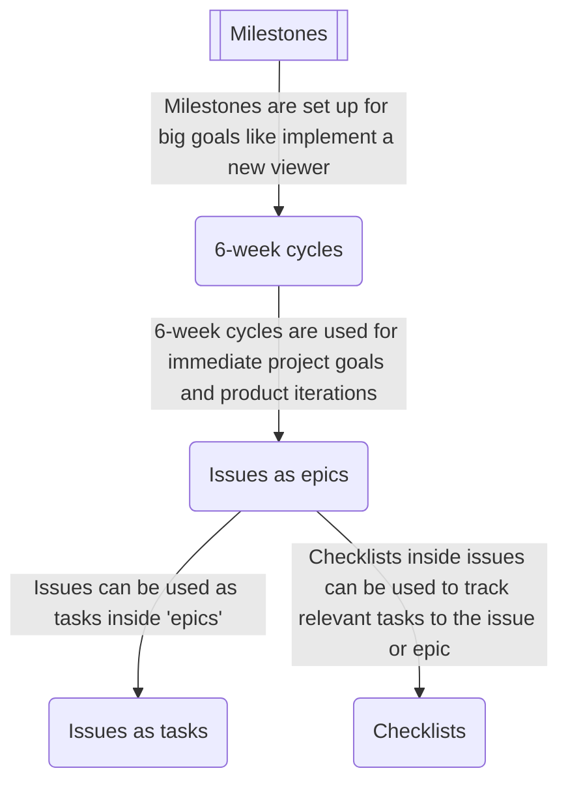

# Top of mind

---
# Top-level priorities
- [ ] 
- [ ] 
- [ ] 

---
# Notes

# Attention
How to pay attention to every moment.  Attention is all you need.  It is the most scarce resource you have.  

How to convert my work in something similar to [[../pages/Shin Okuda]] and his endeavors.  Software in the hospital with style.  

Also discovered Linus Lee, who is working is his own tool and setup. ===Why not===? 

## How to structure projects on Github

--- 
# Daily recap

--- 
# Inbox to process
-  Linus Lee https://thesephist.com/posts/infinite/

