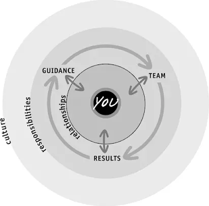

Kim Scott [Radical Candor](Radical%20Candor.md), identifies three areas of responsibility for managers: 

1.  **Guidance**: often called _feedback_ is expressed both in terms of praise and criticism.
2.  **Team-building**: which is about how to keep the team motivated, creating a balance between its components.
3.  **Results**: most apparent, it’s about to get things done.

## The importance of relationships
Relationships are the key drivers for successful managers. These, together with your responsibilities as a manager and the culture of the organization, create a virtuous cycle for management.

