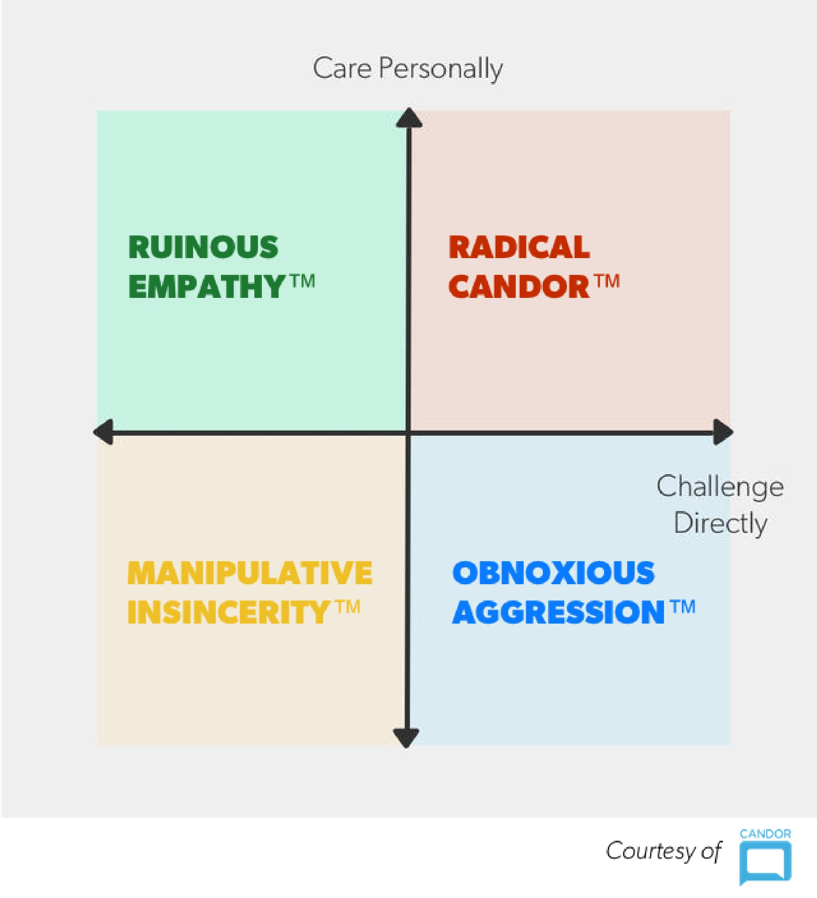

[Radical Candor](https://www.radicalcandor.com/) is a management tool developed by Kim Scott that is designed to help managers on [[guidance]]: giving it, receiving it, and encouraging it.  Radical candor is a management philosophy based on caring personally while challeging directly. 

[[Areas of responsability for managers]]
# Management systems
The following quadrant shows the different kinds of management, considering **caring personally** as the vertical axis and **challenging directly** as the horizontal axis. 

> [!NOTE] The matrix is not an assessment model
> The challenge is to go _intentionally_ to the Radical Candor quadrant as much as possible for all the valuable relationships we have, understanding that we might go through all 4 of the different styles multiple times in the same day. 

## Manipulative insincerity

## Ruinous empathy
## Obnoxious aggression
Management style when you challenge directly without caring personally, 
## Radical candor

# HHIP
Radical candor is: 
* (H) is humble
* (H) is helpful
* (I) is immediate
* (P) is in person – in private if it's a criticism and in public if it's a praise-. 
* (P) is not personalizing. 

# Links to media
* https://youtu.be/MIh_992Nfes
* https://sergiocaredda.eu/inspiration/books/book-review-radical-candor-by-kim-scott/
* 
 